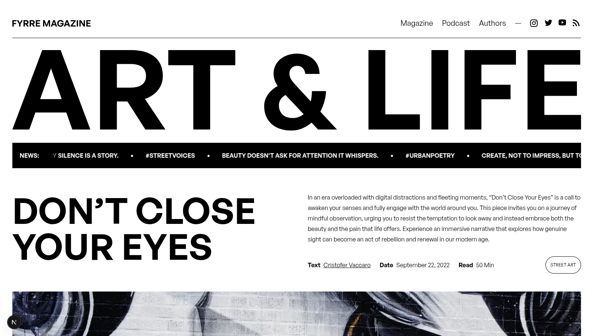

# Fyrre Magazine Website



## Overview

Fyrre Magazine is a cutting-edge digital magazine platform meticulously crafted using Next.js 15. This dynamic publishing solution combines sophisticated design with powerful functionality to deliver an exceptional reading experience. The platform features a seamless content delivery system, enhanced by server-side rendering capabilities and optimized data fetching. With its modern architecture, Fyrre Magazine offers lightning-fast page transitions, responsive layouts, and an intuitive user interface that adapts beautifully across all devices. The platform prioritizes both performance and user engagement, incorporating advanced features like real-time content updates and seamless social media integration, making it an ideal choice for contemporary digital publishing needs.

## Features

- **Modern and Responsive Design**

  - Elegant and intuitive user interface.
  - Perfect adaptation across all devices.
  - Smooth animations and harmonious transitions.

- **Content Management**

  - MDX format article support.
  - Tags and categories system.
  - Custom author profiles.
  - Integrated podcast section.

- **Performance & Accessibility**
  - SEO optimized.
  - Keyboard navigation support.
  - Screen reader compatible.
  - Optimized loading times.

## Technologies

### Core

- [Next.js](https://nextjs.org/) - React framework with Turbopack support
- [React](https://react.dev/) - UI library
- [TypeScript](https://www.typescriptlang.org/) - Static typing

### Styling & UI

- [Tailwind CSS](https://tailwindcss.com/) - Utility-first CSS framework
- [CVA](https://github.com/joe-bell/cva) - Component variant management
- [@radix-ui](https://www.radix-ui.com/) - Accessible UI components

### Content & Data

- [MDX](https://mdxjs.com/) - Enhanced Markdown with JSX
- [gray-matter](https://github.com/jonschlinkert/gray-matter) - Frontmatter parsing
- [next-mdx-remote](https://github.com/hashicorp/next-mdx-remote) - MDX rendering

### Utilities

- [clsx](https://github.com/lukeed/clsx) - Conditional class building
- [date-fns](https://date-fns.org/) - Date manipulation
- [react-focus-lock](https://github.com/theKashey/react-focus-lock) - Focus management

## Prerequisites

- Node.js 18+
- Bun (package manager)

## Installation

```bash
# Clone the repository
git clone https://github.com/souleymanesy7/fyrre-magazine-website.git

# Navigate to directory
cd fyrre-magazine-website

# Install dependencies
bun install

# Start development server
bun run dev
```

## Project Structure

```
fyrre-magazine-website/
├── contents/            # MDX content (magazine, authors, podcast)
├── public/             # Static assets
├── src/
│   ├── app/           # Next.js pages and routes
│   ├── components/    # Reusable React components
│   ├── constants/     # Static data and constants
│   ├── hooks/         # Reusable React Hooks
│   ├── libs/          # Utilities and helpers
│   ├── icons/         # SVG icon components
│   └── types/         # TypeScript types
```

## Configuration

The project uses some configuration files:

- `next.config.ts` - Next.js and Turbopack configuration
- `tsconfig.json` - TypeScript configuration

## Available Scripts

```bash
bun run dev        # Start development server
bun run build      # Build application for production
bun run start      # Start production server
bun run lint       # Check code with ESLint
```

## Contributing

Contributions are welcome! Please follow these steps:

1. Fork the project
2. Create your feature branch (`git checkout -b feature/AmazingFeature`)
3. Commit your changes (`git commit -m 'Add some AmazingFeature'`)
4. Push to the branch (`git push origin feature/AmazingFeature`)
5. Open a Pull Request

---

Developed with ❤️ by [Souleymane Sy](https://github.com/souleymanesy7)
