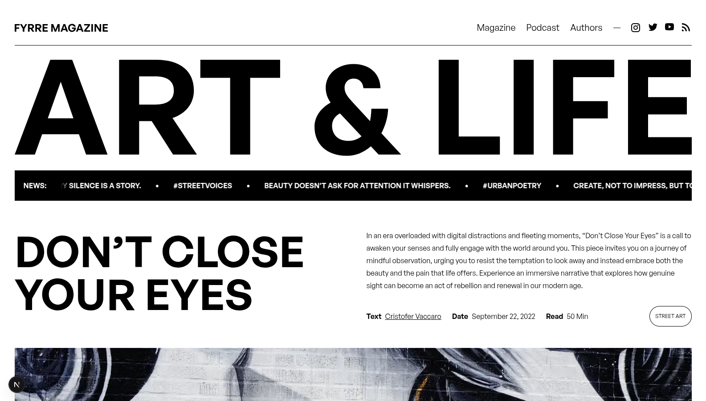
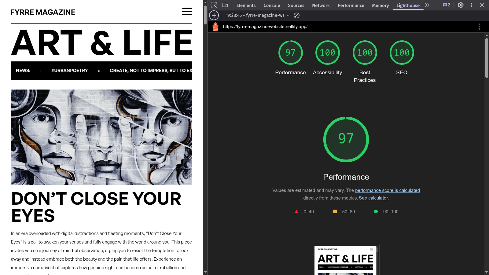

# Fyrre Magazine Website



## Demo

Website Link: [Demo Live Site](https://fyrre-magazine-website.netlify.app/)

Total time spent on this project: [](https://wakatime.com/badge/user/018cb534-87bb-4814-975b-ca5e3cb8572b/project/827caf3f-fbf5-4885-870d-6eaa599484e2)

> **100+ hours** of focused development tracked with [WakaTime](https://wakatime.com/) — every page, route, component, API endpoint, email template, and interaction is fully functional from end to end. No dead links, no unfinished sections. Features a custom-designed 404 page, a dedicated Coming Soon page for temporarily unavailable links, and a complete newsletter pipeline. Just a complete, production-ready digital magazine platform built as a serious learning project with production-grade standards.

---

## Overview

Fyrre Magazine is a cutting-edge digital magazine platform meticulously crafted using Next.js 16. This dynamic publishing solution combines sophisticated design with powerful functionality to deliver an exceptional reading experience.

The platform features a seamless content delivery system enhanced by server-side rendering, optimized data fetching, a fully functional newsletter subscription system powered by Resend, and client-side magazine filtering with URL-synced pagination. With its modern architecture, Fyrre Magazine offers lightning-fast page transitions, responsive layouts, and an intuitive user interface that adapts beautifully across all devices.

The stunning visual design was crafted by [Pawel Gola](https://dribbble.com/pawelgola), bringing the magazine's aesthetic vision to life through elegant typography, thoughtful layouts, and cohesive visual elements.

---

## Features

### Content & Navigation

- MDX format article support with frontmatter parsing
- Magazine **category filtering** with URL search params (`?category=sculptures`)
- URL-synced **Prev / Next pagination** — 6 articles per page (`?page=2`)
- Pagination resets to page 1 automatically when changing category
- Custom author profiles and integrated podcast section

### Newsletter System

- Form validation with **react-hook-form** + **Zod** on both client and server
- **Resend** email delivery API integration
- Subscribers automatically saved to **Resend Audiences** — works without a verified domain
- **Demo mode** — welcome emails redirected to a test address (`RESEND_TEST_EMAIL`)
- **Production mode** — welcome emails sent directly to subscribers (`RESEND_FROM_EMAIL`)
- Admin notification email on every new subscription
- Animated **Toast notifications** with auto-dismiss progress bar
- Reusable **Spinner** component for loading states

### Email Templates (React Email)

- `WelcomeEmail` — welcome email sent to new subscribers
- `AdminNotificationEmail` — instant admin notification with subscriber details
- Design tokens fully synchronized with `globals.css` (colors, spacing, typography)

### Design & Accessibility

- Modern and fully responsive layout across all devices
- Keyboard navigation and screen reader support (`VisuallyHidden`, `aria-*`, `role`)
- SEO optimized with dynamic metadata per page
- Optimized image loading with Next.js `Image` component
- Smooth little animations powered by [**Motion**](https://motion.dev/)

---

## Technologies

### Core

- [Next.js 16](https://nextjs.org/) — React framework with App Router & Webpack
- [React 19](https://react.dev/) — UI library
- [TypeScript 5](https://www.typescriptlang.org/) — Static typing

### Styling & UI

- [Tailwind CSS 4](https://tailwindcss.com/) — Utility-first CSS framework
- [CVA](https://cva.style/) — Component variant management (`cva@1.0.0-beta`)
- [tailwind-merge](https://github.com/dcastil/tailwind-merge) — Tailwind class merging
- [@radix-ui/react-slot](https://www.radix-ui.com/) — Accessible UI primitives
- [clsx](https://github.com/lukeed/clsx) — Conditional class building
- [Motion 12](https://motion.dev/) — Animation library
- [lucide-react](https://lucide.dev/) — Icon library

### Content & Data

- [MDX](https://mdxjs.com/) — Enhanced Markdown with JSX
- [gray-matter](https://github.com/jonschlinkert/gray-matter) — Frontmatter parsing
- [next-mdx-remote 6](https://github.com/hashicorp/next-mdx-remote) — MDX rendering
- [date-fns 4](https://date-fns.org/) — Date manipulation

### Forms & Validation

- [react-hook-form 7](https://react-hook-form.com/) — Performant form management
- [Zod 4](https://zod.dev/) — Schema validation (client & server)
- [@hookform/resolvers 5](https://github.com/react-hook-form/resolvers) — Zod adapter

### Email

- [Resend 6](https://resend.com/) — Email delivery API
- [React Email 5](https://react.email/) — React-based email template components
- [@react-email/components](https://react.email/components) — Email UI primitives

### Utilities

- [react-focus-lock](https://github.com/theKashey/react-focus-lock) — Focus management

---

## Prerequisites

- Node.js 18+
- Bun (package manager)
- A [Resend](https://resend.com/) account (free tier is sufficient)

---

## Installation

```bash
# Clone the repository
git clone https://github.com/souleymanesy7/fyrre-magazine-website.git

# Navigate to directory
cd fyrre-magazine-website

# Install dependencies
bun install

# Start development server
bun run dev
```

---

## Environment Variables

Create a `.env.local` file at the root of the project:

```bash
# ── Required ──────────────────────────────────────────────────────────────────

# Resend API key — get yours at resend.com
RESEND_API_KEY=re_xxxxxxxxxxxxxxxxxx

# Admin email — receives a notification on every new subscriber
NEWSLETTER_TO_EMAIL=your@email.com

# ── Email sending mode (pick one) ─────────────────────────────────────────────
# Demo mode — welcome emails are redirected to this address instead of the real subscriber
# Use this when you don't have a verified domain yet
RESEND_TEST_EMAIL=your@email.com

# Production mode — set this once your domain is verified at resend.com/domains
# When defined, welcome emails are sent directly to the real subscriber
# RESEND_FROM_EMAIL=hello@your-domain.com
```

> **How it works without a verified domain:** Resend's free plan only allows sending emails to your own account address. With `RESEND_TEST_EMAIL` set, welcome emails are redirected to you for preview — while every subscriber's email is still saved in your Resend Audience list. When you add a verified domain, just set `RESEND_FROM_EMAIL` and remove `RESEND_TEST_EMAIL`. No code changes required.

## Project Structure

```
fyrre-magazine-website/
├── contents/                            # MDX content files
│   ├── magazine/                        # Magazine articles
│   ├── authors/                         # Author profiles
│   └── podcast/                         # Podcast episodes
│
├── public/                              # Static assets
│   ├── assets/                          # Images and media
│   └── preview/                         # README preview images
│
├── src/
│   ├── app/                             # Next.js App Router
│   │   ├── api/
│   │   │   └── newsletter/              # POST /api/newsletter — Resend integration
│   │   ├── authors/                     # Authors listing + individual pages
│   │   ├── coming-soon/                 # Dedicated coming soon page for unavailable links
│   │   ├── magazine/                    # Magazine listing — category filter + pagination
│   │   ├── podcast/                     # Podcast listing + individual episodes
│   │   ├── style-guide/                 # Internal design system reference
│   │   ├── favicon.ico
│   │   ├── globals.css                  # Global styles & design tokens
│   │   ├── layout.tsx                   # Root layout
│   │   ├── not-found.tsx                # Custom 404 page
│   │   └── page.tsx                     # Homepage
│   │
│   ├── components/
│   │   ├── common/                      # Reusable UI primitives
│   │   │   ├── Button.tsx
│   │   │   ├── Card.tsx
│   │   │   ├── Container.tsx
│   │   │   ├── Form.tsx
│   │   │   ├── Input.tsx
│   │   │   ├── List.tsx
│   │   │   ├── SkipToContents.tsx
│   │   │   ├── Title.tsx
│   │   │   └── VisuallyHidden.tsx
│   │   ├── ui/                          # Reusable UI components
│   │   │   ├── DateFormatter.tsx
│   │   │   ├── Headline.tsx
│   │   │   ├── LinkWithArrow.tsx
│   │   │   ├── Marquee.tsx
│   │   │   ├── Pagination.tsx           # Prev/Next navigation with URL sync
│   │   │   ├── PrintEditionCard.tsx     # Cover card with hover overlay + coming soon CTA
│   │   │   ├── ScrollIndicator.tsx
│   │   │   ├── Spinner.tsx              # Animated 4-bar loading indicator
│   │   │   └── Toast.tsx                # Slide-up notification with progress bar
│   │   ├── navigation/                  # Navigation components
│   │   │   ├── Footer.tsx
│   │   │   ├── HamburgerMenu.tsx
│   │   │   ├── Header.tsx
│   │   │   ├── Navbar.tsx
│   │   │   ├── NavbarDesktop.tsx
│   │   │   ├── NavbarMobile.tsx
│   │   │   └── SingleNav.tsx
│   │   ├── sections/                    # Page section components
│   │   │   ├── homepage/
│   │   │   │   ├── HomepageAuthorList.tsx
│   │   │   │   ├── HomepageHero.tsx
│   │   │   │   ├── HomepageMagazineList.tsx
│   │   │   │   ├── HomepagePodcastList.tsx
│   │   │   │   └── HomepageSidebar.tsx
│   │   │   ├── magazine/
│   │   │   │   ├── MagazineCategories.tsx  # Category filter with URL sync
│   │   │   │   ├── MagazineLatestArticles.tsx
│   │   │   │   ├── MagazinePostContents.tsx
│   │   │   │   ├── MagazinePostHero.tsx
│   │   │   │   ├── MagazinePostSidebar.tsx
│   │   │   │   ├── MagazineSummaryCard.tsx
│   │   │   │   └── Magazines.tsx           # Magazine grid with filter + pagination
│   │   │   ├── authors/
│   │   │   │   ├── AuthorContents.tsx
│   │   │   │   ├── AuthorSideBar.tsx
│   │   │   │   └── AuthorSummaryCard.tsx
│   │   │   └── podcast/
│   │   │       ├── PodcastContents.tsx
│   │   │       ├── PodcastSidebar.tsx
│   │   │       └── PodcastSummaryCard.tsx
│   │   ├── forms/                       # Form components
│   │   │   └── NewsletterForm.tsx       # Unified form — footer & sidebar variants
│   │   └── errors/                      # Error & fallback pages
│   │       └── Custom404.tsx
│   │
│   ├── emails/                          # React Email templates
│   │   ├── WelcomeEmail/
│   │   │   ├── WelcomeEmail.tsx
│   │   │   └── style.ts                 # Design tokens mirrored from globals.css
│   │   └── AdminNotificationEmail/
│   │       ├── AdminNotificationEmail.tsx
│   │       └── style.ts                 # Design tokens mirrored from globals.css
│   │
│   ├── hooks/
│   │   └── usePagination.ts             # Client-side pagination with URL search params
│   │
│   ├── constants/                       # Static data and configuration
│   ├── libs/                            # Utility functions and helpers
│   ├── icons/                           # SVG icon components
│   ├── types/                           # TypeScript type definitions
│   └── validators/                      # Zod schemas (email, forms)
│
├── .gitignore
├── bun.lock
├── eslint.config.mjs
├── next.config.ts                       # Next.js & Webpack configuration
├── postcss.config.mjs                   # PostCSS configuration for Tailwind
├── tsconfig.json                        # TypeScript configuration
└── package.json
```

---

## Email Preview

Preview your email templates locally with React Email:

```bash
bunx email dev --dir src/emails
```

Opens a live preview server at `http://localhost:3000` with hot reload for all email templates.

---

## Performance

- Lighthouse Score:
  - Performance: 97/100
  - Accessibility: 100/100
  - Best Practices: 100/100
  - SEO: 100/100



---

## Available Scripts

```bash
bun run dev        # Start development server with Webpack
bun run build      # Build for production + copy MDX contents to .next/standalone
bun run start      # Start production server
bun run lint       # Run ESLint
```

---

## Configuration

- `next.config.ts` — Next.js and Webpack configuration
- `tsconfig.json` — TypeScript configuration
- `.env.local` — Environment variables (see above)

---

## Contributing

Contributions are welcome! Please follow these steps:

1. Fork the project
2. Create your feature branch (`git checkout -b feature/AmazingFeature`)
3. Commit your changes (`git commit -m 'Add some AmazingFeature'`)
4. Push to the branch (`git push origin feature/AmazingFeature`)
5. Open a Pull Request

---

Developed with ❤️ by [Souleymane Sy](https://github.com/souleymanesy7)
